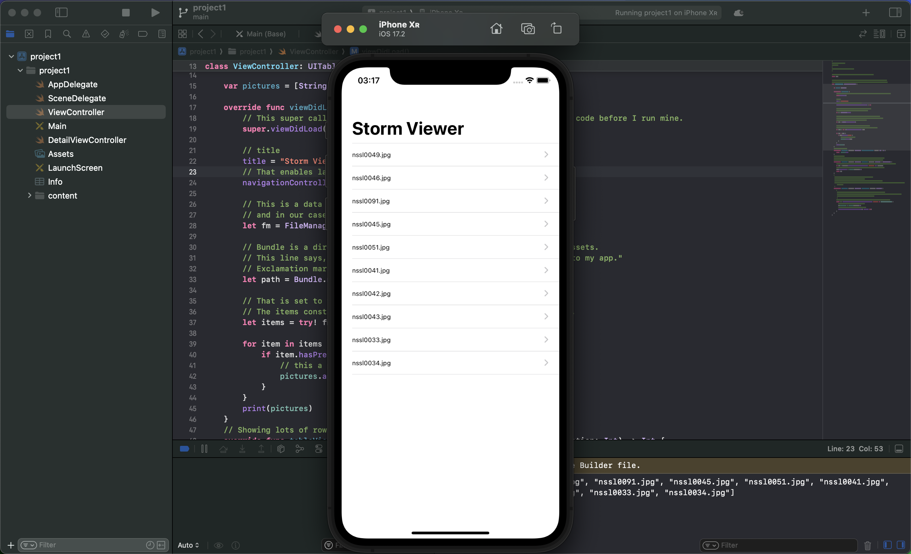

# UIKit

##  Project 1, part two, UIImageView, UIImage, UINavigationBar, and more...

I completed the basics of our app, but of course, it’s missing one important component: it isn’t drawing any pictures! For an app called Storm Viewer, this part seems rather important.

